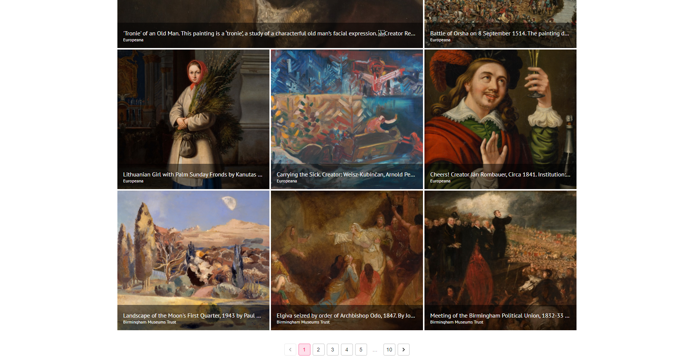

### FS 1010 course project image gallery web app

2021-1

```
npm install
```

```
npm start
```

- navbar: class component + css file
- home page: function component + styled-components: auto display feature
- gallery page:axios call from unsplash api, material-UI,hooks, pagination
- https://github.com/theanam/react-awesome-lightbox for lightbox feature in gallery page
- contact us form : after input validate info, button will showe success submit. This form link to express project of FS1020, we can get input data in data/entiresDB.json


<br>


<br>


<br>


<br>


