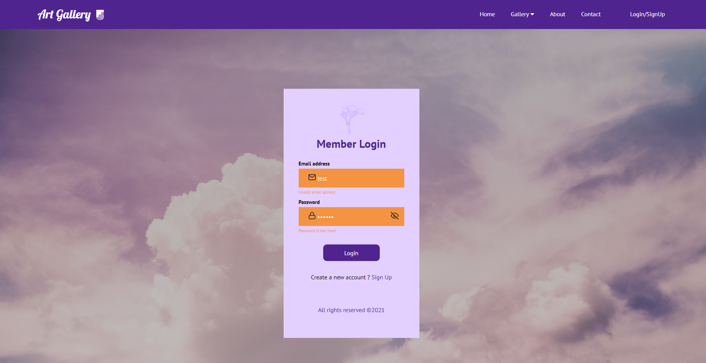
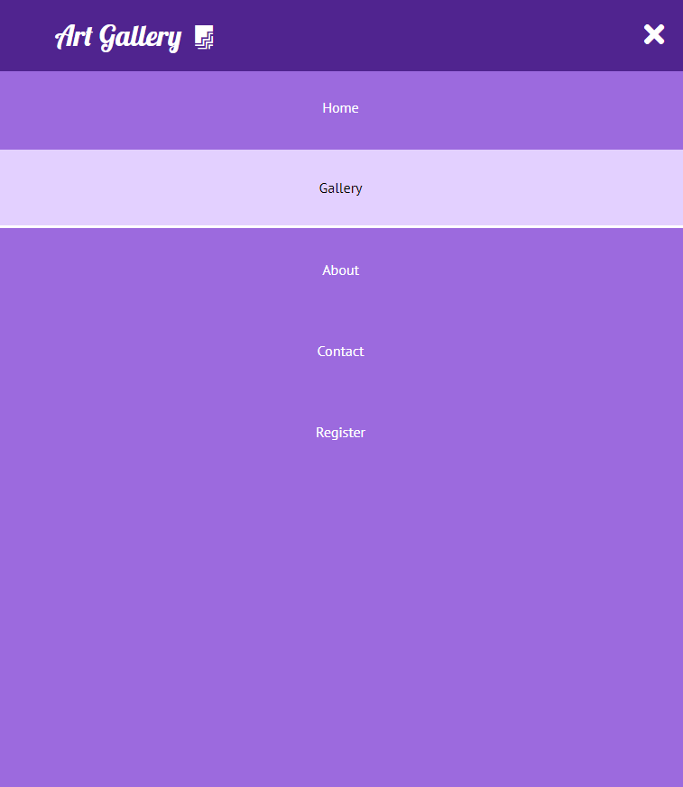

### FS 1010 course project image gallery web app

2021-1

install all dependencies before run

```
npm install
```

```
npm start
```

- navbar: class component + css file
- home page: function component + styled-components: auto display feature
- gallery page:axios call from unsplash api, material-UI,hooks, pagination
- https://github.com/theanam/react-awesome-lightbox plugin for lightbox feature in gallery page
- contact us form : after input validate info, button will show success submit. This form link to express project of FS1020 PORT 5000, we can receive data in data/entiresDB.json
- register page includes (sign up & login page)
- yup plugin for validation form
- formik plugin to build form (https://formik.org/docs/api/useField)
- react-loader-spinner plugin after click login, showing a loading status
- auth uses redux


<br>


<br>


<br>


<br>


<br>


<br>


<br>


